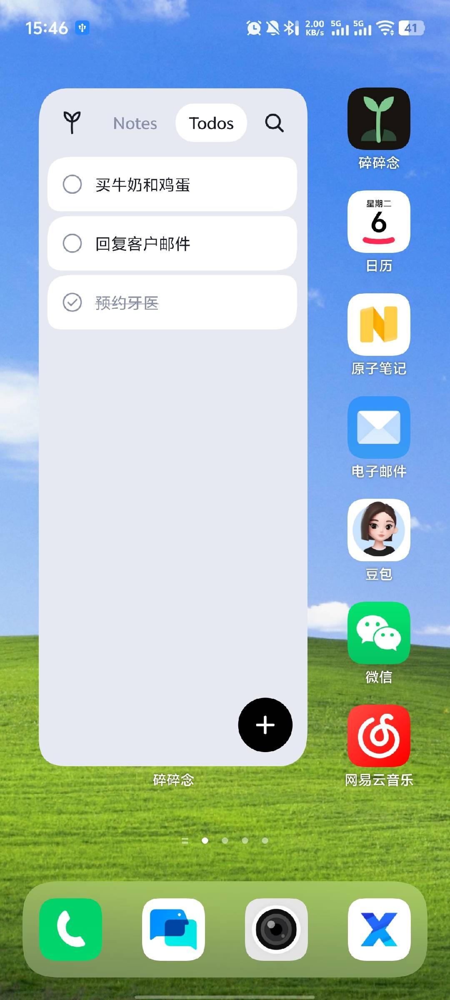
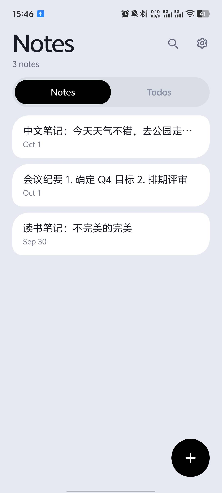
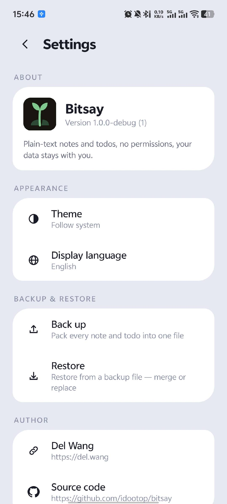
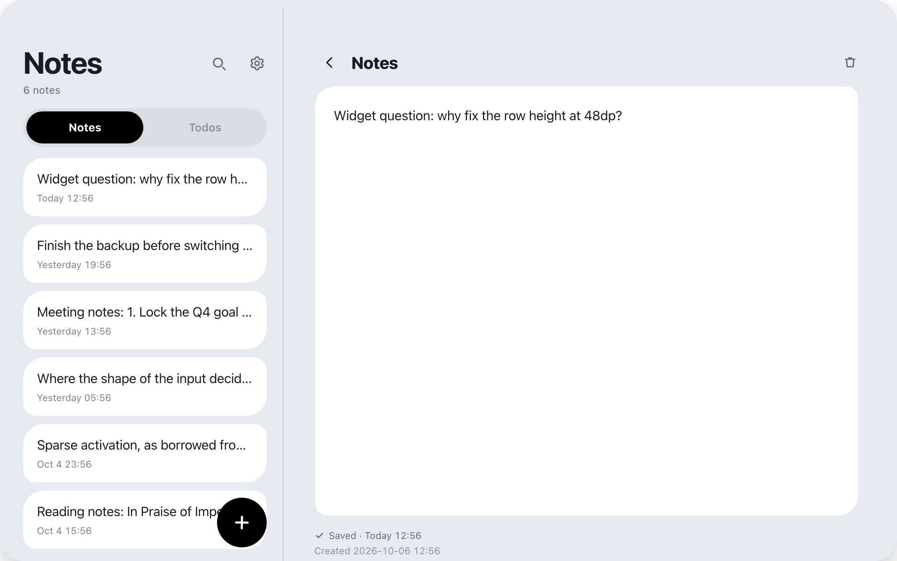

<h1>BitSay</h1>

<strong>A notes &amp; todos app that lives on your home screen.</strong>

 
 
 
 

---

## Preview

    

On the home screen &nbsp;·&nbsp; Notes &nbsp;·&nbsp; Settings

  

On a wide screen the list stays put and the editor opens beside it

## What it does

- **The widget is the app.** Read the list, tick things off, search, or add something new — all from the home screen, without opening anything.
- **What matters stays in front of you.** The list you can’t afford to forget sits where you already look a hundred times a day.
- **Quick capture.** Tap `+`, start typing, walk away. What you write is saved as you write it.
- **Plain text, nothing else.** No titles, no formatting, no attachments, no folders. One note is one block of text.
- **Backup and restore.** Export everything into a single file, import it on your next phone.
- **No permissions, no network.** Nothing to sign in to; your notes stay in a local database on your phone.
- **Light and dark**, English and 中文, and layouts for phones, tablets and unfolded foldables.
- **2 MB.** No ads, no account, no telemetry.

## Install

Download `Bitsay.apk` from [**Releases**](https://github.com/idootop/bitsay/releases/latest) and open it on your phone. Requires **Android 12 or newer**.

## License

MIT License © 2026-PRESENT [Del Wang](https://github.com/idootop)
