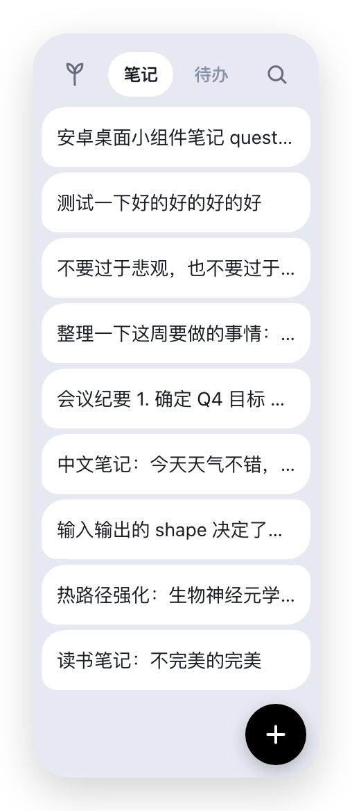
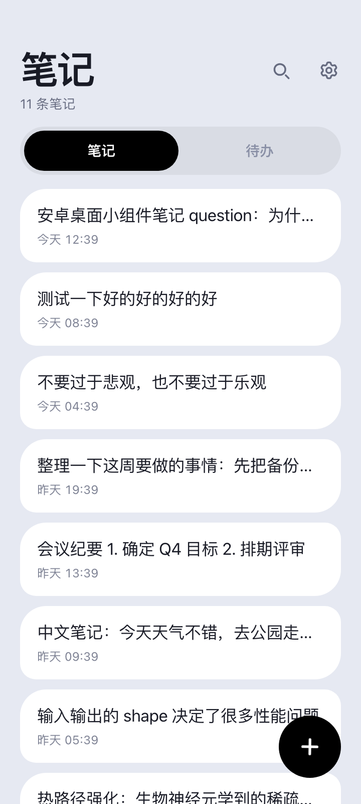
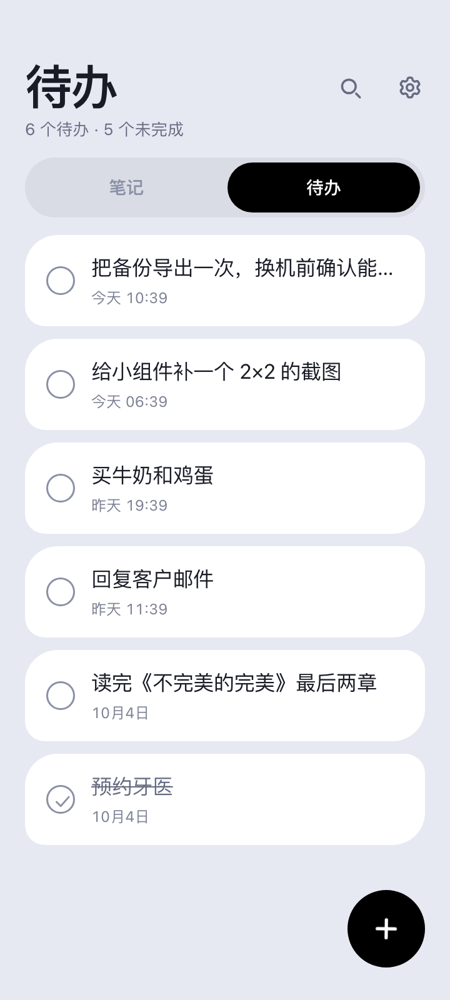
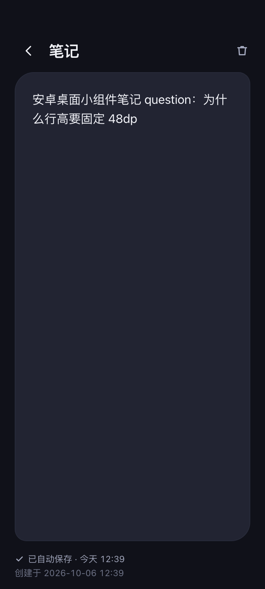
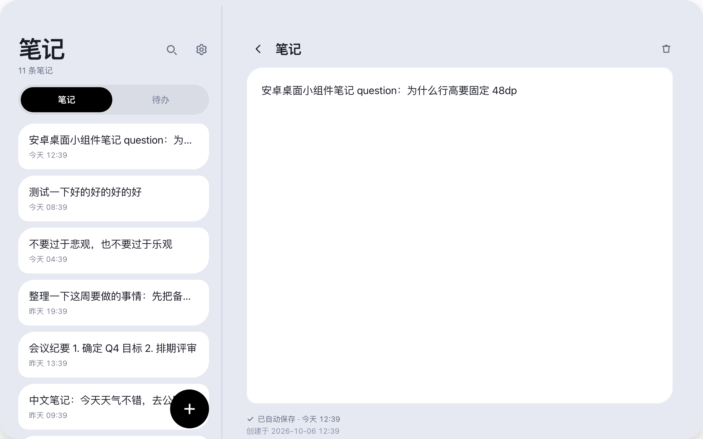

<h1>碎碎念 · BitSay</h1>

<strong>笔记和待办，一直看得见。</strong>

 
 

<a href="https://github.com/idootop/bitsay/releases/latest"><b>下载</b></a> &nbsp;·&nbsp; <a href="README.md">English</a>

---

## 为什么是碎碎念

**📌 不用打开 App，就在桌面上记。** 小组件本身就是入口 —— 写一条笔记、勾一条待办、搜一下列表，全在桌面完成，没有启动页，不用等。

**⚡ 灵感不等人。** 点 **+** 直接开写，边写边存。所以一句没写完的话，能扛住一个来电、一次锁屏、一次没电关机。

**👀 重要的事，放在你一定会看到的地方。** 把你真正在意的那张列表 —— 今天要做的事、总是忘的那一件 —— 放在每天要看上百次的桌面上。眼不见，心就真的会忘；这个就是治它的。

**🔒 丢不了，也传不出去。** 全程自动保存。一键导出完整备份，换手机时一键还原。App **不申请任何权限**，代码里也没有联网逻辑 —— 数据存在本地数据库里，就待在那儿。

**🪶 又小又安静。** **2 MB**，没有广告，不用注册，没有账号，没有埋点。MIT 协议，免费开源。

**📱 换什么设备都合适。** 亮色与暗色、中文与 English；布局从手机一路适配到平板和折叠屏展开 —— 宽屏下列表留在原地，编辑器在旁边打开，而不是把列表盖掉。

## 截图

  
  
  
  

桌面小组件 &nbsp;·&nbsp; 笔记 &nbsp;·&nbsp; 待办 &nbsp;·&nbsp; 编辑器（暗色）

  

## 安装

到 [**Releases**](https://github.com/idootop/bitsay/releases/latest) 下载最新的 `Bitsay-x.y.z.apk`，在手机上点开即可。系统会问一次「是否允许从此来源安装应用」—— 这是你唯一会看到的询问，因为这个 App 不再要任何东西。

每个版本的说明里都附了安装包的 SHA-256 和签名证书指纹，想核对可以自己核。

## 系统要求

**Android 12（API 31）及以上。**

这不是随手定的下限：桌面小组件用的 `RemoteViews.RemoteCollectionItems`、`targetCellWidth`、`previewLayout` 都是 API 31 才有的接口，而它们正是 Android 17 上仍然推荐的那套集合式组件 API。

App **不申请任何权限** —— 没有网络、没有存储、没有通知。

## 许可

MIT License © 2026-PRESENT [Del Wang](https://github.com/idootop)
