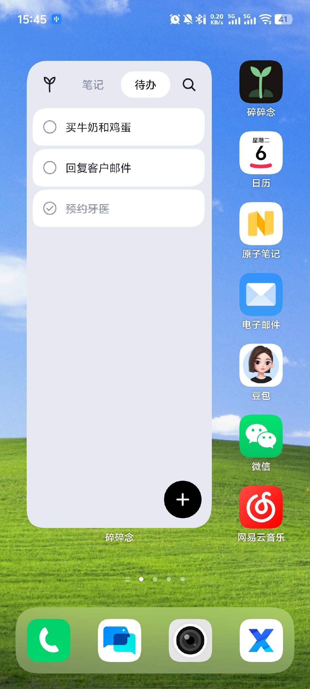
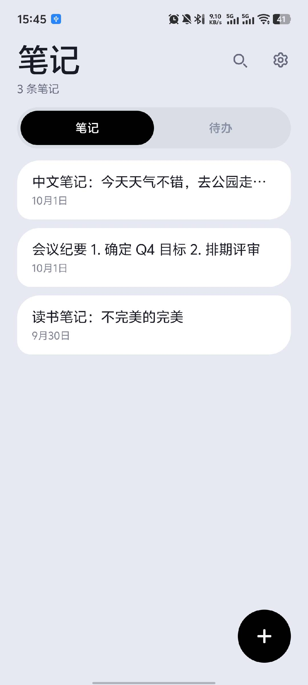
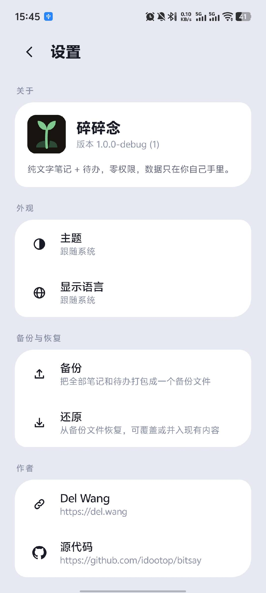
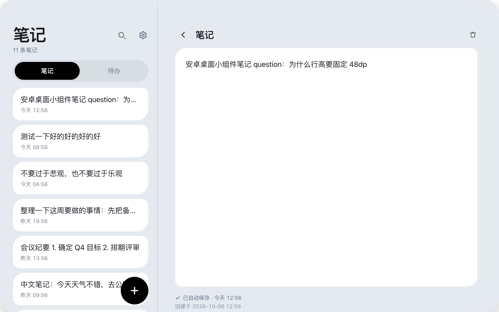

<h1>碎碎念</h1>

<strong>一个极简的桌面小组件：笔记 &amp; 待办</strong>

 
 
 
 

---

## 预览

    

桌面小组件 &nbsp;·&nbsp; 笔记 &nbsp;·&nbsp; 设置

  

完美适配平板、折叠屏设备

## 它能做什么

- **小组件就是主界面。** 查看、完成、搜索、新建，全在桌面完成，不用打开 App。
- **重要的事摆在最显眼的地方。** 把笔记和待办，放在每天要看上百次的桌面上。
- **记下转瞬即逝的灵感。** 点 `+` 就开始写，边写边存，自动保存。
- **备份与还原。** 一键备份还原，换手机时导入就行，数据永不丢失。
- **零权限，不联网。** 不用登录，笔记就存在手机本地的数据库里。
- **亮色 / 暗色**，中文 / English，手机、平板、折叠屏展开都能用。
- **2 MB。** 没有广告，不用注册，没有账号，没有埋点。

## 安装

到 [**Releases**](https://github.com/idootop/bitsay/releases/latest) 下载 `Bitsay.apk` 安装即可，最低支持 **Android 12**。

## 许可

MIT License © 2026-PRESENT [Del Wang](https://github.com/idootop)
